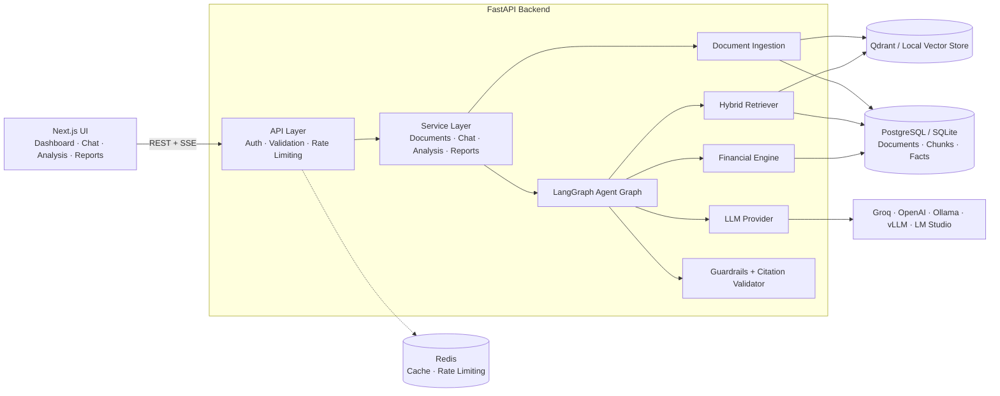
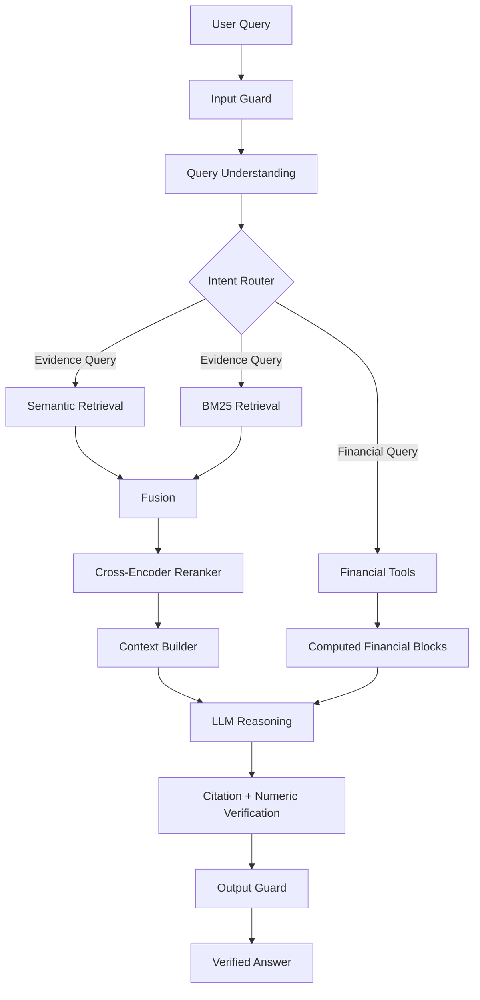
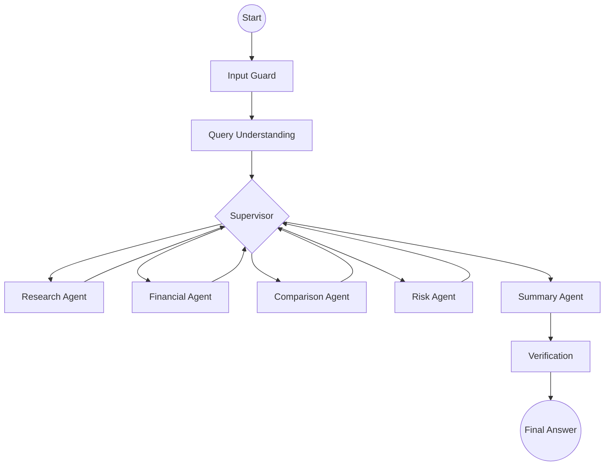
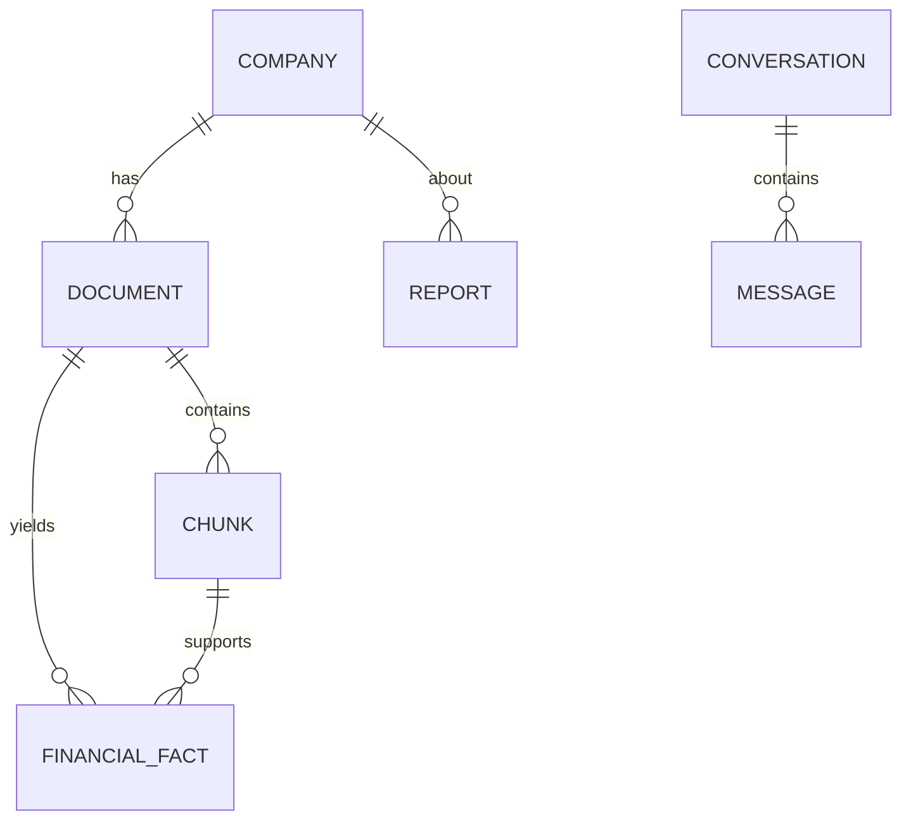

# FinResearch AI

<p align="center">

**AI-Powered Financial Research & Analysis Platform**

Transform financial documents into **evidence-grounded insights, financial analysis, comparisons, and research reports** using RAG, LangGraph agents, deterministic financial calculations, and AI guardrails.

</p>

<p align="center">


</p>

---

## 📌 Overview

**FinResearch AI** is an AI-powered financial research and analysis platform designed to analyze annual reports, quarterly results, earnings-call transcripts, financial statements, and other business documents.

Users can upload financial documents and ask questions in natural language. The system retrieves relevant evidence, performs deterministic financial calculations, orchestrates specialized agents, validates citations and numerical claims, and generates grounded research responses.

Unlike a conventional **"Chat with PDF"** application, FinResearch AI is specifically designed around the challenges of financial documents:

* Financial tables
* Reporting periods
* Financial ratios
* Company comparisons
* Trend analysis
* Risk analysis
* Citation verification
* Numerical grounding
* Prompt-injection protection

> ⚠️ **Disclaimer:** FinResearch AI is an analytical research assistant, not a financial advisor. Its outputs may contain errors and should be independently verified. It does not provide investment advice, trading recommendations, or guaranteed returns.

---

# 🎯 Problem

Traditional RAG systems can struggle with financial documents.

| Challenge                                   | FinResearch AI Solution                                                  |
| ------------------------------------------- | ------------------------------------------------------------------------ |
| LLMs may perform arithmetic incorrectly     | Financial calculations are performed using a deterministic Python engine |
| Fixed-size chunks can split tables          | Financial-aware and layout-aware chunking                                |
| Exact financial terms can be missed         | Hybrid semantic + BM25 retrieval                                         |
| Tables are difficult to retrieve accurately | Dedicated financial-statement retrieval lane                             |
| LLMs may hallucinate numbers                | Numeric grounding and post-generation validation                         |
| Citations may not support answers           | Citation verification against retrieved evidence                         |
| Every query unnecessarily calls an LLM      | Deterministic intent routing                                             |
| Documents can contain prompt injection      | Input and document-level guardrails                                      |
| Missing information can cause hallucination | Explicit `Not available` / `Insufficient evidence` handling              |

---

# ✨ Key Features

### 📄 Financial Document Intelligence

Supports:

* PDF
* DOCX
* XLSX
* TXT
* Markdown

The ingestion pipeline extracts:

* Company
* Document type
* Fiscal year
* Quarter
* Currency
* Reporting unit
* Financial tables
* Sections
* Financial facts

Supported PDF processing uses **PyMuPDF** and **pdfplumber**, with OCR support when Tesseract is available.

---

### 🔎 Hybrid RAG

FinResearch AI combines:

* Dense semantic retrieval
* BM25 keyword retrieval
* Weighted fusion
* Reciprocal-rank fusion
* Cross-encoder reranking
* Structured financial-statement retrieval

Default retrieval configuration:

```text
Semantic Retrieval → 70%
Keyword Retrieval  → 30%
```

The retrieved contexts are then reranked before being passed to the reasoning layer.

---

### 🤖 Agentic AI with LangGraph

The system uses a **LangGraph supervisor architecture** with specialized agents.

```text
                         User Query
                             │
                             ▼
                       Input Guard
                             │
                             ▼
                   Query Understanding
                             │
                             ▼
                       Supervisor
                             │
          ┌──────────┬───────┼────────┬──────────┐
          ▼          ▼       ▼        ▼          ▼
       Research   Financial Compare   Risk     Summary
        Agent      Agent     Agent    Agent     Agent
          │          │       │        │          │
          └──────────┴───────┴────────┴──────────┘
                             │
                             ▼
                    Citation Validation
                             │
                             ▼
                    Numeric Verification
                             │
                             ▼
                       Final Answer
```

### Specialized Agents

| Agent                | Responsibility                              |
| -------------------- | ------------------------------------------- |
| **Research Agent**   | Retrieves and synthesizes document evidence |
| **Financial Agent**  | Calculates ratios, metrics and trends       |
| **Comparison Agent** | Compares companies and reporting periods    |
| **Risk Agent**       | Identifies financial risk signals           |
| **Summary Agent**    | Generates the final research response       |

The architecture supports nine query intents including document Q&A, financial calculations, trend analysis, company comparison, period comparison, risk analysis, management analysis and general finance.

---

# 📊 Financial Analysis Engine

One of the core design principles is:

> **The LLM should reason about financial numbers — not calculate them.**

Financial calculations are performed programmatically using Python.

### Liquidity

* Current Ratio
* Quick Ratio

### Solvency

* Debt-to-Equity
* Debt Ratio
* Interest Coverage

### Profitability

* ROE
* ROA
* Net Profit Margin
* EBITDA Margin

### Efficiency

* Inventory Turnover
* Receivables Turnover
* Asset Turnover

### Growth & Trends

* Revenue Growth
* Profit Growth
* Asset Growth
* CAGR
* YoY trends

### Risk

* Rule-based risk signals
* Financial deterioration indicators
* Trend-based observations
* Illustrative extrapolation

The financial engine currently implements **18 financial ratios** across liquidity, solvency, profitability, efficiency and growth categories.

---

# 🛡️ Grounded AI & Anti-Hallucination

Financial AI requires strong verification because an incorrect number can completely change an analysis.

FinResearch AI therefore uses a multi-stage verification pipeline:

```text
User Query
    │
    ▼
Input Guard
    │
    ▼
Intent Detection
    │
    ▼
Evidence Retrieval
    │
    ▼
Financial Calculation
    │
    ▼
LLM Reasoning
    │
    ▼
Citation Validation
    │
    ▼
Numeric Grounding
    │
    ▼
Output Guard
    │
    ▼
Verified Response
```

### Verification capabilities

* Citation validation
* Numeric grounding
* Evidence checking
* Computed-value verification
* Unknown citation removal
* Insufficient-evidence handling
* Missing-data handling

When required evidence is unavailable, the system can return:

```text
Not available
```

rather than inventing a value.

---

# 🔐 AI Security & Guardrails

FinResearch AI includes multiple AI-security controls.

### Prompt Injection Protection

Protects against:

* Direct prompt injection
* Prompt injection embedded inside uploaded documents
* Instructions disguised as financial content

Retrieved documents are treated as **untrusted data** rather than trusted instructions.

### Financial Safety

The system also detects and handles:

* Guaranteed-return requests
* Market-manipulation requests
* Investment-advice language
* Off-topic requests

---

# 📚 Evidence & Citations

A major design principle is **traceability**.

Financial answers can reference:

```text
Document
   ↓
Page
   ↓
Section
   ↓
Chunk
   ↓
Financial Fact
   ↓
Calculation
   ↓
Answer
```

Example:

```text
Debt-to-Equity: 0.64x

Formula:
Total Debt / Shareholders' Equity

Total Debt:
INR 3,500 crore

Shareholders' Equity:
INR 5,500 crore

Source:
Annual Report FY2025
Consolidated Balance Sheet
Page 5
```

This makes the output easier to audit and independently verify.

---

# 📸 Screenshots

> Screenshots below are the **existing project images** and have intentionally been retained unchanged.

| Dashboard                                         | Financial Analysis                                             | Research Chat                                                   |
| ------------------------------------------------- | -------------------------------------------------------------- | --------------------------------------------------------------- |
|  |  |  |

Captured from the running application using synthetic sample financial filings.

---

# 🏗️ Architecture



---

# 🔄 RAG Pipeline

## Document Ingestion


### Financial-aware chunking

The system recognizes different document sections and chunk types:

```text
financial_statement
table
risk_factor
management_commentary
earnings_commentary
accounting_policy
notes
narrative
```

Each chunk can retain:

* Company
* Document
* Fiscal year
* Page range
* Section
* Chunk type

---

# 🔍 Query Pipeline



---

# 🤖 Agent Architecture



### Agent routing

| Query Type            | Agent Plan            |
| --------------------- | --------------------- |
| Document Q&A          | Research              |
| Management Analysis   | Research + Financial  |
| Financial Calculation | Financial → Research  |
| Trend Analysis        | Financial → Research  |
| Summary               | Financial → Research  |
| Company Comparison    | Comparison → Research |
| Period Comparison     | Comparison → Research |
| Risk Analysis         | Risk → Research       |
| General Finance       | Summary               |

Only the appropriate financial agents produce numerical outputs, while the summary layer is responsible for natural-language generation.

---

# 🗃️ Data Model



### Core entities

```text
Company
Document
Chunk
FinancialFact
Conversation
Message
QueryTrace
Report
```

Financial facts can contain:

* Metric
* Period
* Value
* Scale
* Unit
* Currency
* Page
* Confidence

---

# 🧰 Technology Stack

| Layer                   | Technology                               |
| ----------------------- | ---------------------------------------- |
| **Backend**             | Python 3.10+, FastAPI, Pydantic, Uvicorn |
| **Agent Orchestration** | LangGraph                                |
| **RAG**                 | Hybrid Semantic + BM25                   |
| **Embeddings**          | BGE / FastEmbed                          |
| **Reranking**           | MiniLM Cross-Encoder                     |
| **Vector Store**        | Qdrant / Local Vector Store              |
| **Database**            | PostgreSQL / SQLite                      |
| **Cache**               | Redis                                    |
| **LLM**                 | OpenAI-compatible APIs                   |
| **LLM Providers**       | Groq, OpenAI, Ollama, vLLM, LM Studio    |
| **PDF Processing**      | PyMuPDF, pdfplumber                      |
| **Office Documents**    | python-docx, openpyxl                    |
| **Frontend**            | Next.js 15, React 19, TypeScript         |
| **Styling**             | Tailwind CSS                             |
| **Charts**              | Recharts                                 |
| **Deployment**          | Render / Vercel                          |
| **Containers**          | Docker / Docker Compose                  |
| **Observability**       | LangSmith / OpenTelemetry                |

Most major infrastructure components are configurable through environment variables.

---

# 📁 Project Structure

```text
FinResearch-AI/
│
├── backend/
│   ├── app/
│   │   ├── api/
│   │   ├── agents/
│   │   ├── rag/
│   │   ├── documents/
│   │   ├── financial/
│   │   ├── guardrails/
│   │   ├── evaluation/
│   │   ├── llm/
│   │   ├── services/
│   │   ├── models/
│   │   └── utils/
│   │
│   └── tests/
│
├── frontend/
│   ├── app/
│   ├── components/
│   ├── hooks/
│   └── lib/
│
├── data/
│   └── samples/
│
├── evaluation/
│   └── dataset.jsonl
│
├── scripts/
│   ├── generate_sample_data.py
│   ├── seed_demo.py
│   └── run_evaluation.py
│
├── docs/
│   └── screenshots/
│
├── docker-compose.yml
├── render.yaml
├── .env.example
└── README.md
```

---

# ⚡ Getting Started

## Prerequisites

* Python 3.10+
* Node.js
* npm
* Git

Docker is optional for local development.

---

## 1. Clone the Repository

```bash
git clone https://github.com/Niladri962/FinResearch-AI.git

cd FinResearch-AI
```

---

# 2. Backend Setup

```bash
cd backend

python -m venv .venv
```

### Windows

```bash
.venv\Scripts\activate
```

### macOS / Linux

```bash
source .venv/bin/activate
```

Install dependencies:

```bash
pip install -r requirements-dev.txt
```

Start FastAPI:

```bash
uvicorn app.main:app --reload --port 8000
```

Backend:

```text
http://localhost:8000
```

API documentation:

```text
http://localhost:8000/api/docs
```

---

# 3. Frontend Setup

Open a new terminal:

```bash
cd frontend

npm install
```

Create:

```bash
.env.local
```

Set:

```env
NEXT_PUBLIC_API_URL=http://localhost:8000
```

Start the frontend:

```bash
npm run dev
```

Open:

```text
http://localhost:3000
```

---

# 4. Generate Sample Data

The project includes synthetic financial documents for demonstration.

```bash
python scripts/generate_sample_data.py
```

Then seed the running backend:

```bash
python scripts/seed_demo.py
```

Example queries:

```text
Why did Aurora's operating margin decline?

What is Aurora's debt-to-equity ratio?

Compare Aurora with Borealis.

What are the major financial risks?

How has revenue changed over time?
```

The sample companies are **fictional** and are intended only for demonstration and evaluation.

---

# 🔑 LLM Configuration

FinResearch AI can run without an external LLM using extractive responses.

For generated answers, configure an OpenAI-compatible provider.

Example:

```env
LLM_PROVIDER=auto
LLM_API_KEY=your_api_key
LLM_MODEL=llama-3.3-70b-versatile
```

The platform can work with:

```text
Groq
OpenAI
Ollama
vLLM
LM Studio
Other OpenAI-compatible endpoints
```

Without an LLM API key, the application can still provide:

* Retrieved evidence
* Financial calculations
* Source citations
* Extractive answers

---

# 🐳 Docker

Create the environment file:

```bash
cp .env.example .env
```

Set the required variables and run:

```bash
docker compose up --build
```

The Docker environment starts:

```text
Frontend
Backend
PostgreSQL
Qdrant
Redis
```

Default host ports:

```text
Frontend → 3000
Backend  → 8000
```

---

# ⚙️ Environment Variables

Important configuration variables include:

| Variable                      | Purpose                      |
| ----------------------------- | ---------------------------- |
| `LLM_PROVIDER`                | LLM provider selection       |
| `LLM_API_KEY`                 | LLM API key                  |
| `LLM_MODEL`                   | LLM model                    |
| `LLM_BASE_URL`                | OpenAI-compatible endpoint   |
| `EMBEDDING_PROVIDER`          | Embedding backend            |
| `EMBEDDING_MODEL`             | Embedding model              |
| `RERANKER_PROVIDER`           | Reranker backend             |
| `RERANKER_MODEL`              | Reranker model               |
| `SEMANTIC_WEIGHT`             | Semantic retrieval weight    |
| `KEYWORD_WEIGHT`              | BM25 retrieval weight        |
| `VECTOR_STORE`                | Vector store selection       |
| `QDRANT_URL`                  | Qdrant endpoint              |
| `QDRANT_API_KEY`              | Qdrant authentication        |
| `DATABASE_URL`                | Database connection          |
| `REDIS_URL`                   | Redis connection             |
| `AUTH_ENABLED`                | Enable authentication        |
| `API_KEYS`                    | API key / role configuration |
| `LANGCHAIN_API_KEY`           | LangSmith integration        |
| `OTEL_EXPORTER_OTLP_ENDPOINT` | OpenTelemetry endpoint       |

See `.env.example` for the complete configuration.

---

# 🔌 API

Interactive API documentation:

```text
http://localhost:8000/api/docs
```

### Documents

```http
POST /api/documents/upload
GET  /api/documents
GET  /api/documents/{id}
GET  /api/documents/{id}/facts
DELETE /api/documents/{id}
```

### Chat

```http
POST /api/chat
GET  /api/chat/conversations
DELETE /api/chat/conversations/{id}
```

### Analysis

```http
POST /api/analyze
POST /api/compare
POST /api/financial-ratios
```

### Reports

```http
POST /api/reports/generate
GET  /api/reports
GET  /api/reports/{id}
```

### System

```http
GET /api/dashboard
GET /api/system
GET /api/health
GET /api/observability/traces
```

---

# 💬 Example API Request

```bash
curl -s localhost:8000/api/chat \
  -H "Content-Type: application/json" \
  -d '{"message":"What is Aurora'\''s debt-to-equity ratio?","stream":false}'
```

Example response:

```json
{
  "intent": "FINANCIAL_CALCULATION",
  "mode": "extractive",
  "calculations": [
    {
      "id": "C1",
      "name": "Debt-to-Equity",
      "period": "FY2025",
      "display": "0.64x",
      "formula": "Total Debt / Shareholders' Equity"
    }
  ],
  "validation": {
    "status": "grounded",
    "grounding_score": 1.0
  }
}
```

---

# 📈 Evaluation

The project includes an evaluation framework for retrieval and answer quality.

Supported metrics include:

* Recall@K
* Precision@K
* Mean Reciprocal Rank
* Context Relevance
* Faithfulness
* Answer Relevance
* Key-Fact Recall
* Citation Precision
* Page Hit Rate
* Optional RAGAS metrics

Run offline evaluation:

```bash
python scripts/run_evaluation.py --offline
```

Run isolated evaluation:

```bash
python scripts/run_evaluation.py --isolated
```

Run with RAGAS:

```bash
python scripts/run_evaluation.py --isolated --ragas
```

### Current Regression Baseline

The repository includes a small synthetic evaluation dataset.

| Metric              | Offline Stack | BGE + MiniLM |
| ------------------- | ------------: | -----------: |
| Recall@5 / Hit Rate |          1.00 |         1.00 |
| MRR                 |          0.83 |         0.77 |
| Precision@5         |          0.34 |         0.35 |
| Faithfulness        |          1.00 |         1.00 |
| Key-Fact Recall     |          0.86 |         0.83 |
| Citation Precision  |          0.67 |         0.71 |
| Page Hit Rate       |          1.00 |         1.00 |

> These results are regression baselines from a small synthetic corpus, not production benchmarks. They should not be interpreted as evidence of real-world financial accuracy.

---

# 🧪 Testing

The backend includes extensive automated tests covering:

* Financial calculations
* Ratio computation
* Period parsing
* Financial label mapping
* Table extraction
* PDF/DOCX/XLSX parsing
* Chunking
* Embeddings
* Vector stores
* Hybrid retrieval
* Reranking
* Agent routing
* Guardrails
* Citation validation
* LLM integration
* Authentication
* RBAC
* Rate limiting
* API endpoints
* Evaluation pipeline

Run backend tests:

```bash
cd backend
pytest
```

Frontend checks:

```bash
cd frontend

npm run typecheck
npm run build
```

---

# 🔒 Security

FinResearch AI includes multiple application and AI-security controls.

### File Security

* Extension allow-list
* Magic-byte validation
* File-size limits
* SHA-256 deduplication
* Server-generated filenames
* Path traversal protection
* Sanitized filenames

### Authentication

Optional API authentication supports:

```text
viewer
analyst
admin
```

### Rate Limiting

Supports Redis-backed or in-process rate limiting.

### Prompt Injection

The system protects against both:

```text
Direct prompt injection
        +
Prompt injection embedded in documents
```

### Secrets

Provider keys remain server-side and are loaded through environment variables.

### Network Security

Includes:

* CORS allow-listing
* Security headers
* Non-root containers
* Database isolation in Docker Compose

---

# 📊 Observability

Each query can generate a trace containing:

* Query intent
* Agent plan
* Retrieval latency
* Embedding latency
* Vector-search latency
* BM25 latency
* Reranking latency
* LLM latency
* Verification latency
* Token usage
* Retrieved document IDs
* Retrieved chunk IDs
* Validation status
* Errors

Optional integrations:

```text
LangSmith
OpenTelemetry
OTLP collectors
```

---

# ☁️ Deployment

FinResearch AI is structured for cloud deployment.

### Frontend

Recommended:

```text
Vercel
```

Set:

```env
NEXT_PUBLIC_API_URL=https://your-api-url
```

### Backend

Supported deployment targets include:

```text
Render
Railway
AWS ECS
AWS App Runner
```

### Production Infrastructure

```text
                    ┌──────────────────┐
                    │      Vercel      │
                    │   Next.js App    │
                    └────────┬─────────┘
                             │
                             ▼
                    ┌──────────────────┐
                    │     Render       │
                    │     FastAPI      │
                    └───────┬──────────┘
                            │
              ┌─────────────┼─────────────┐
              ▼             ▼             ▼
        PostgreSQL       Qdrant        Redis
              │             │             │
              └─────────────┼─────────────┘
                            │
                            ▼
                       LLM Provider
```

Production recommendations:

* Enable authentication
* Use strong API keys
* Configure CORS correctly
* Enable TLS
* Use persistent storage
* Use managed PostgreSQL
* Use managed Redis
* Use Qdrant Cloud or another production vector store

### Step-by-step: Vercel frontend + hosted backend

Vercel hosts the Next.js frontend only. The backend cannot run on Vercel: it loads embedding and reranking models, keeps uploaded files, a database and a search index on disk, and spends minutes processing a large report — none of which fits serverless functions. Deploy the backend to a container host first, then point the frontend at it.

**1. Backend (Render shown; Railway, Fly.io or AWS work the same way)**

1. In Render choose **New → Blueprint** and select this repository. [render.yaml](render.yaml) creates the API service, a PostgreSQL database and a persistent disk at `/data`.
2. Fill in the prompted variables:
   * `LLM_API_KEY` — for generated answers (leave empty for extractive mode)
   * `QDRANT_URL` / `QDRANT_API_KEY` — a [Qdrant Cloud](https://cloud.qdrant.io) cluster, or remove both and set `VECTOR_STORE=local` to keep vectors on the disk
   * `API_KEYS` — e.g. `<long-random-string>:admin` (the blueprint turns `AUTH_ENABLED` on)
   * `CORS_ORIGINS` — leave blank for now; it is set in step 3
3. Deploy and note the public URL, e.g. `https://finresearch-api.onrender.com`. Opening `…/api/health` should return `"status": "ok"`.

Use an instance with **at least 2 GB of memory** (the blueprint requests one). The default models need about 1 GB at rest and more while embedding a large report; a 512 MB instance is killed during ingestion. To run on a small instance, set `EMBEDDING_PROVIDER=openai` and `RERANKER_PROVIDER=lexical` so no model is loaded in-process.

**2. Frontend on Vercel**

1. At [vercel.com/new](https://vercel.com/new) import this repository.
2. Set **Root Directory** to `frontend`. The framework is detected as Next.js; [frontend/vercel.json](frontend/vercel.json) adds security headers.
3. Add the environment variable `NEXT_PUBLIC_API_URL` with your backend URL from step 1 — `https://`, no trailing slash.
4. Deploy.

`NEXT_PUBLIC_API_URL` is compiled into the browser bundle, so changing it requires a redeploy. If it is missing or uses `http://`, the app shows a banner explaining what to fix instead of failing silently.

**3. Connect the two**

Set these on the backend and redeploy it:

```env
CORS_ORIGINS=https://<your-project>.vercel.app
# optional: also allow Vercel preview deployments
CORS_ORIGIN_REGEX=https://<your-project>(-[a-z0-9-]+)?\.vercel\.app
```

Open the Vercel URL, go to **Settings**, paste the key you put in `API_KEYS`, and save. That key identifies you to your backend and is stored only in your browser. LLM, embedding and Qdrant keys stay on the backend and never reach Vercel.

| Symptom | Cause |
|---|---|
| Red banner: "no backend configured" | `NEXT_PUBLIC_API_URL` not set on Vercel, or set after the last build |
| "Cannot reach the API" while the backend is up | The Vercel origin is not in `CORS_ORIGINS` / `CORS_ORIGIN_REGEX` |
| HTTP 401 on every page | `AUTH_ENABLED=true` and no key saved on the Settings page |
| First request takes about a minute | Idle backend instances sleep on some plans and reload models on wake |
| Upload fails on a large PDF | Instance out of memory (see the 2 GB note), or the host's request-size limit is below `MAX_UPLOAD_MB` |

---

# ⚠️ Known Limitations

FinResearch AI is an active research and engineering project.

Current limitations include:

* Financial table extraction is heuristic
* Complex merged tables may not extract perfectly
* Scanned tables may require OCR
* Quarterly analytics are currently limited compared with annual analytics
* No automatic currency conversion
* Some financial ratios use period-end balances
* Guardrails are pattern-based
* BM25 is currently in-process
* Database migrations are not yet implemented
* Real production Qdrant deployment requires separate infrastructure configuration
* Evaluation uses a small synthetic dataset

These limitations are intentionally documented rather than hidden.

---

# 🛣️ Future Roadmap

### Data & Financial Intelligence

* [ ] XBRL ingestion
* [ ] NSE/BSE document integration
* [ ] SEC filing integration
* [ ] Real-time financial data
* [ ] Currency normalization
* [ ] Quarterly analytics
* [ ] TTM analysis
* [ ] Advanced peer benchmarking

### RAG & AI

* [ ] Native Qdrant hybrid sparse+dense retrieval
* [ ] Vision-model financial table extraction
* [ ] Larger real-world evaluation datasets
* [ ] LLM-as-a-judge evaluation
* [ ] Advanced citation verification
* [ ] Knowledge graph integration

### Security

* [ ] OIDC / OAuth
* [ ] JWT authentication
* [ ] Multi-tenant data isolation
* [ ] Audit logs
* [ ] Advanced AI security policies

### Platform

* [ ] Background job queue
* [ ] Research report PDF export
* [ ] Cited PDF page previews
* [ ] Human-in-the-loop research workflows
* [ ] Advanced agent observability

---

# 🧠 What This Project Demonstrates

FinResearch AI demonstrates practical implementation of:

```text
Generative AI
      │
      ├── RAG
      ├── Hybrid Search
      ├── Agentic AI
      ├── LangGraph
      ├── LLM Orchestration
      │
      ├── Financial NLP
      ├── Document Intelligence
      ├── Financial Analytics
      │
      ├── AI Guardrails
      ├── Prompt Injection Defense
      ├── Citation Verification
      ├── Numeric Grounding
      │
      ├── LLM Evaluation
      ├── Observability
      └── Production AI Engineering
```

The project is designed around an important principle:

> **Reliable AI systems require more than an LLM. They require retrieval, deterministic tools, validation, security, evaluation and observability.**

---

# 👨‍💻 Author

## Niladri Ghosh

AI & Data Science | Generative AI | RAG | Agentic AI | Financial AI

### Connect

**GitHub:**
https://github.com/Niladri962

**Project:**
https://github.com/Niladri962/FinResearch-AI

---

# 🤝 Contributing

Contributions and suggestions are welcome.

### 1. Fork the repository

### 2. Create a feature branch

```bash
git checkout -b feature/your-feature
```

### 3. Commit your changes

```bash
git commit -m "feat: add your feature"
```

### 4. Push your branch

```bash
git push origin feature/your-feature
```

### 5. Open a Pull Request

---

# ⭐ Support

If you find this project useful:

⭐ **Star the repository**

🍴 **Fork the project**

🐛 **Report issues**

💡 **Suggest improvements**

---

<div align="center">

## FinResearch AI

**From Financial Documents → Evidence → Analysis → Intelligence**

Built with **Python · FastAPI · LangGraph · RAG · Next.js · LLMs**

</div>
